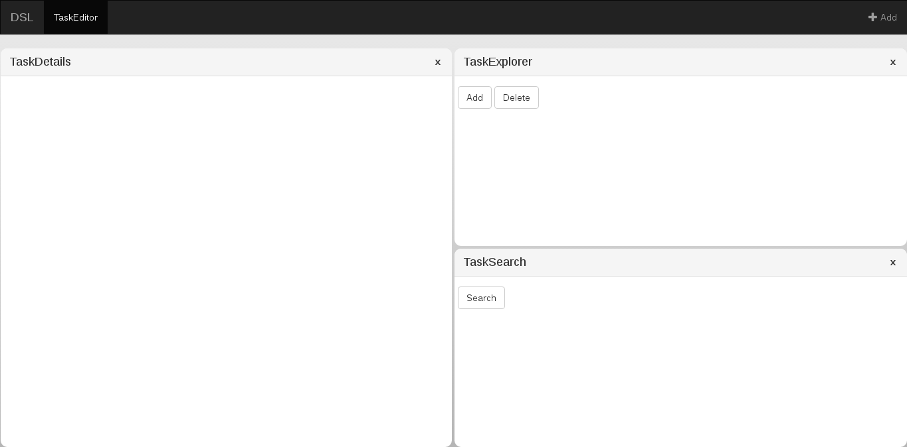

### Table of Contents
* [vindue](#vindue)
	* [Tree](#TreeStructure)
	* [Drag and Drop](#DnD)

<a name="vindue" />
# vindue



<a name="TreeStructure" />
## Tree-Structure

The windowstate is stored as a tree. Additionally, the nodes save the current configuration (size, orientation, children and - if it's a leaf-node - loaded panel). The image below shows the **start configuration for each of the following tree-modifications**.


### Adding a panel

Adding a panel is done by clicking the top-left button. A window is shown, where the user can select the panel content and the panel is add as the last element of the tree. Using drag and drop, the user can place the panel.


### Closing a panel (Elevation 1)

Closing a panel is done by clicking the top-left button of a panel (marked with an 'x'). In the following example the red panel has been closed. Because this leaves the parent-node with one child remaining, the (only) child is elevated by one level and therefore replaces its parent.


### Promoting panels (Elevation 2)

'Promoting' is a special closing-case and done when a node is left with one child, which isn't a panel leaf-node. Promoting elevates panels by two levels. If for example the green panel is closed, its parent is left with one child (the only child). If the only child were elevated by one level (therefore replaces its parent), the orientation of its children would be switched (thus messing up the configuration). Therefore, the only child's children are elevated by two levels, which preserves the orientation.


<a name="DnD" />
## Drag and Drop


The user can drag a panel by the panel-header and drop it onto another panel. Upon dragging a panel above another one a hover-information appears, which indicates where the panel will be dropped. The image above shows the differen regions a panel can be dropped into:

- North = red
- West = green
- Center = blue
- East = yellow
- South = grey


The regions have the aspect ratio shown in the image above:

- center: 1.618
- top, left, right, bottom: 1

### North / South dropping


### West / East dropping


## App-Structure


```
TreeComponent
├── TreeHeaderComponent
└── NodeComponent
    ├── NodeComponent (TaskExplorer)
    │   ├── PanelHeaderComponent
    │   └── PanelComponent
    │       ├── ComponentOutlet
    │       └── PinIndicator
    ├── SeparatorComponent
    └── NodeComponent (TaskDetails)
        ├── PanelHeaderComponent
        └── PanelComponent
            ├── ComponentOutlet
            └── PinIndicator
```
